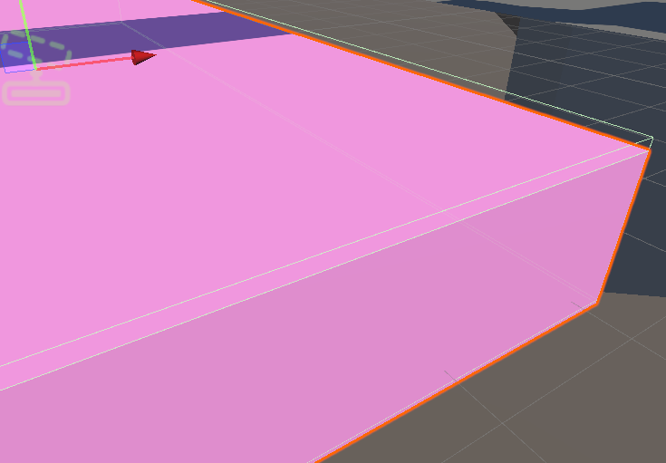

# Intro
_KRCC_ (Kinematic Rigidbody Character Controller)是一种给予动力学并含有刚体互动的角色控制。实现了以下功能

- 上下坡移动
- 台阶移动
- 沿墙移动时滑行
- 地面检测（贴合地面）
- 移动平台
- 可互动刚体交互

包含了以下组件:

-  [_Kinematic Rigidbody Character Controller_](#krcc)
-  [_Moving Platform_](#mv)

#   Kinematic Rigidbody CC
_KRCC_ 依赖 _Rigidbody_ 以及 _Capsule_ 组件, 并保持 _Rigidbody_ 的 isKinematic 和 UseGravity 属性为 false.

_KRCC_ 本身依靠 Collide and Slide 算法实现，其本质是在单位事件内进行多次位移来适应复杂的地形，在平滑移动和控制方面相对于单纯的 _Rigidbody_ 拥有绝对的优势。
同时该组件集成了对于移动平台（_MovingPlatform_）的支持，模拟了真实的物理碰撞。

同时位移时考虑了 _ContactOffset_, 意味着可以像寻常物理组件一样执行碰撞检测。
## 面板属性
| 属性名称               | 描述                          |
|--------------------|-----------------------------|
| Max Iterations     | FixedUpdate 帧内最迭次数          |
| Max Step Height    | 最大步进高度                      |
| Max Slope Angle    | 最大可攀爬坡度                     |
| Energy Loss Factor | 碰撞时能量损失系数, 为0时损失最大          |
| Gravity            | 默认重力，不会被自行调用，需要在操控脚本中自行调用计算 |
| Ground Layer       | 地形检测 LayerMask              |
| Interact Layer     | 互动刚体 LayerMask              |

#   Moving Platform 
_Moving Platform_ 依赖两个 _BoxCollider_ 和 _Rigidbody_ 组件运作。

一个碰撞箱用于碰撞，而另一个碰撞箱作为触发器将 _KRCC_ 附加到该移动平台上进行移动，为保证安全， 触发器需要稍稍超出
需要站立的平面一些。

_Rigidbody_ 需保持动力学状态，用来和其他动态刚体组件产生正确的交互。

